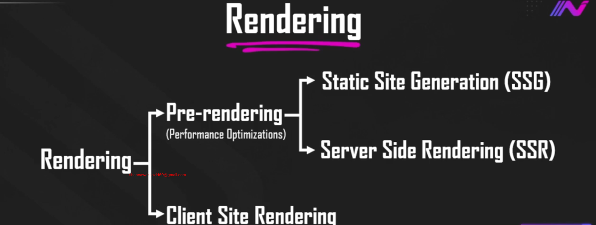

# Next Js Core Concept Part-1

In this module, we’ll dive into the core concepts of Next.js to take your skills to the next level. You’ll learn how to optimize images, fonts, and metadata for better performance and SEO, explore pre-rendering strategies like SSG, SSR, and ISR, and practice advanced data fetching techniques. We’ll also cover global error handling, active links, and wrap up with hands-on tasks to solidify your learning.

## 52-1 Optimize image using Image Component

```tsx
import Image from "next/image";
import nextImg from "../../../assets/31343C.svg"; // for local
const GalleryPage = () => {
  return (
    <div className="text-center">
      <h1>Regular Image Tag</h1>
      

      <h1>Next.js image Component</h1>

      <Image
        src="https://placehold.co/600x400/png"
        alt="next image"
        width={500}
        height={500}
        className="mx-auto"
      />

      <h1>Local image Component</h1>

      {/* for local width and height is not mandatory actually  */}
      <Image src={nextImg} alt="next image" className="mx-auto" />

      <h1>From Public Local</h1>

      <Image
        src="/31343C.svg"
        alt="next image"
        width={500}
        height={500}
        className="mx-auto"
      />
    </div>
  );
};

export default GalleryPage;
```

- for the `Image` component we have to setup `next.config.mjs`

```mjs
import type { NextConfig } from "next";

const nextConfig: NextConfig = {
  // images: {
  //   remotePatterns: [new URL('https://placehold.co/600x400/png')],
  // },
  images: {
    remotePatterns: [
      {
        protocol: "https",
        // hostname: 's3.amazonaws.com', // for grabbing image from trusted sources only
        hostname: "**", // this allows images from, all sources
        // port: '',
        // pathname: '/my-bucket/**',
        // search: '',
      },
    ],
  },
};

export default nextConfig;
```

## 52-2 Optimize Fonts, Improve SEO with Metadata, and Use Import Aliases

- By default next js uses fonts which comes from `next/font/google`

```tsx
import type { Metadata } from "next";
import { Geist, Geist_Mono } from "next/font/google";
import "./globals.css";

const geistSans = Geist({
  variable: "--font-geist-sans",
  subsets: ["latin"],
});

const geistMono = Geist_Mono({
  variable: "--font-geist-mono",
  subsets: ["latin"],
});

export const metadata: Metadata = {
  title: "Create Next App",
  description: "Generated by create next app",
};

export default function RootLayout({
  children,
}: Readonly<{
  children: React.ReactNode;
}>) {
  return (
    <html lang="en">
      <body
        className={`${geistSans.variable} ${geistMono.variable} antialiased`}
      >
        <main className="min-h-dvh">{children}</main>
      </body>
    </html>
  );
}
```

- here default variable font is used. lets use the font now


- using the font

```tsx
import type { Metadata } from "next";
import { Geist, Geist_Mono } from "next/font/google";
import "./globals.css";

const geistSans = Geist({
  variable: "--font-geist-sans",
  subsets: ["latin"],
});

const geistMono = Geist_Mono({
  variable: "--font-geist-mono",
  subsets: ["latin"],
});

export const metadata: Metadata = {
  title: "Create Next App",
  description: "Generated by create next app",
};

export default function RootLayout({
  children,
}: Readonly<{
  children: React.ReactNode;
}>) {
  return (
    <html lang="en">
      <body className={geistMono.className}>
        <main className="min-h-dvh">{children}</main>
      </body>
    </html>
  );
}
```

- using roboto font in entire site

```tsx
import type { Metadata } from "next";
import { Geist, Geist_Mono, Roboto } from "next/font/google";
import "./globals.css";

const geistSans = Geist({
  variable: "--font-geist-sans",
  subsets: ["latin"],
});

const geistMono = Geist_Mono({
  variable: "--font-geist-mono",
  subsets: ["latin"],
});

const roboto = Roboto({
  weight: "400",
  subsets: ["latin"],
});

export const metadata: Metadata = {
  title: "Create Next App",
  description: "Generated by create next app",
};

export default function RootLayout({
  children,
}: Readonly<{
  children: React.ReactNode;
}>) {
  return (
    <html lang="en">
      <body
        // className={geistMono.className}
        className={roboto.className}
      >
        <main className="min-h-dvh">{children}</main>
      </body>
    </html>
  );
}
```

#### If we want to use different font in a specific place

- Load fonts in layout.tsx: import Google fonts with both className (for global default) and variable (so you can selectively apply them). Example:
- inside the layout.tsx

```tsx
const roboto = Roboto({ variable: "--font-roboto", subsets: ["latin"] });
const geistSans = Geist({ variable: "--font-geist-sans", subsets: ["latin"] });
```

- Then set `<body className={${roboto.variable} ${geistSans.variable}}>`.
- Expose them in CSS (optional but clean): in globals.css, map font variables to utility classes:

```tsx
.font-roboto { font-family: var(--font-roboto); }
.font-geist-sans { font-family: var(--font-geist-sans); }

```

- Use fonts selectively in components:
  - Default site font comes from body (roboto).
  - For special cases, apply class on elements:

```tsx
<h2 className="font-geist-sans">Card Title</h2>
<p className="font-roboto">Card description</p>

```

### Lets talk about the Meta data

- in layout.tsx file default meta data is given

```tsx
import type { Metadata } from "next";
import { Geist, Geist_Mono, Roboto } from "next/font/google";
import "./globals.css";

const geistSans = Geist({
  variable: "--font-geist-sans",
  subsets: ["latin"],
});

const geistMono = Geist_Mono({
  variable: "--font-geist-mono",
  subsets: ["latin"],
});

const roboto = Roboto({
  weight: "400",
  subsets: ["latin"],
});

export const metadata: Metadata = {
  title: "Create Next App",
  description: "Generated by create next app",
};

export default function RootLayout({
  children,
}: Readonly<{
  children: React.ReactNode;
}>) {
  return (
    <html lang="en">
      <body
        // className={geistMono.className}
        className={roboto.className}
      >
        <main className="min-h-dvh">{children}</main>
      </body>
    </html>
  );
}
```

- but we want dynamic
- lets take it the about page should have different meta data

```tsx
import { Metadata } from "next";
import styles from "./About.module.css";

export const metadata: Metadata = {
  title: "About Page",
  description: "This is about page",
};

const AboutPage = () => {
  return (
    <div>
      <h1 className={styles.text_style}>About Page</h1>
    </div>
  );
};

export default AboutPage;
```

- `like this we can set static meta data we can generate dynamic meta data and set og images`

### lets talk about import alias

- relative path import

```
import nextImg from "../../../assets/31343C.svg"
```

- absolute path import

```
import nextImg from "@/assets/31343C.svg"
```

## 52-3 Explain core concept of pre-rendering (SSG + SSR)



- pre rendering performance optimization is done by using static site generation (ssg) and server side rendering(ssr)

### SSG- Static Site Generation

- when we build a project and then we host the project maybe in vercel
- In the initial state of deployment we make a `build` folder
- Next.js makes the static content `HTML` bundle in the build time and the files are deployed in hosting server
- when we hit a route, from the hosting server the html content will come to browser and will be shown to user

### Server side rendering

- In the same way project is build and hosted in hosting server.
- Suppose user want to see a dynamic data like post whose id is 1 (dynamic).
- first user will hit then server will take the request and search in database
- when data is found the database will send it to server and server will generate html file using the data info and then will send to the user as response.
- both SSG and SSR is handled by server but SSG is faster than ssr since in ssg the data is static and already made in build time.

## 52-4 Set-up Json Server for Next Level Data Fetching

- we will create a dummy server in our project and do these.
- for creating a dummy server we will use `json-server` npm in our project
  [json-server-npm](https://www.npmjs.com/package/json-server)
- install

```
npm i json-server
```

- root folder -> db.json

```json
{
  "products": [
    {
      "id": "1",
      "product_name": "Aegis Pro 15",
      "category": "Laptop",
      "brand": "PowerCore",
      "price": 1999,
      "image": "https://picsum.photos/seed/laptop1/400/300"
    },
    {
      "id": "2",
      "product_name": "Nimbus X1",
      "category": "Smartphone",
      "brand": "Skyline",
      "price": 899,
      "image": "https://picsum.photos/seed/phone2/400/300"
    },
    {
      "id": "3",
      "product_name": "Pulse Studio Over-Ear",
      "category": "Headphones",
      "brand": "SoundRipple",
      "price": 149,
      "image": "https://picsum.photos/seed/headphones3/400/300"
    },
    {
      "id": "4",
      "product_name": "Verta 27\" IPS",
      "category": "Monitor",
      "brand": "Viewark",
      "price": 329,
      "image": "https://picsum.photos/seed/monitor4/400/300"
    },
    {
      "id": "5",
      "product_name": "Quill Mechanical",
      "category": "Keyboard",
      "brand": "KeyCrafters",
      "price": 119,
      "image": "https://picsum.photos/seed/keyboard5/400/300"
    },
    {
      "id": "6",
      "product_name": "SwiftTrack Pro",
      "category": "Mouse",
      "brand": "GlideWorks",
      "price": 59,
      "image": "https://picsum.photos/seed/mouse6/400/300"
    },
    {
      "id": "7",
      "product_name": "Bolt NVMe 1TB",
      "category": "SSD",
      "brand": "FlashForge",
      "price": 129,
      "image": "https://picsum.photos/seed/ssd7/400/300"
    },
    {
      "id": "8",
      "product_name": "Halo AX6000",
      "category": "Router",
      "brand": "NetPulse",
      "price": 199,
      "image": "https://picsum.photos/seed/router8/400/300"
    },
    {
      "id": "9",
      "product_name": "SlatePad 10",
      "category": "Tablet",
      "brand": "Tabra",
      "price": 449,
      "image": "https://picsum.photos/seed/tablet9/400/300"
    },
    {
      "id": "10",
      "product_name": "Orion Mirrorless",
      "category": "Camera",
      "brand": "LumaTech",
      "price": 1199,
      "image": "https://picsum.photos/seed/camera10/400/300"
    },
    {
      "id": "11",
      "product_name": "Tempo Classic",
      "category": "Smartwatch",
      "brand": "Wristly",
      "price": 199,
      "image": "https://picsum.photos/seed/watch11/400/300"
    },
    {
      "id": "12",
      "product_name": "InkJet Pro M404",
      "category": "Printer",
      "brand": "Printiva",
      "price": 179,
      "image": "https://picsum.photos/seed/printer12/400/300"
    },
    {
      "id": "13",
      "product_name": "ArcLight Desk Lamp",
      "category": "Accessory",
      "brand": "LumiDesk",
      "price": 39,
      "image": "https://picsum.photos/seed/lamp13/400/300"
    },
    {
      "id": "14",
      "product_name": "Guardian UPS 1500VA",
      "category": "Power",
      "brand": "EnerSafe",
      "price": 259,
      "image": "https://picsum.photos/seed/ups14/400/300"
    },
    {
      "id": "15",
      "product_name": "CineRing LED Panel",
      "category": "Lighting",
      "brand": "ProLite",
      "price": 89,
      "image": "https://picsum.photos/seed/light15/400/300"
    }
  ]
}
```

- as our frontend is running in port 3000 we will run the dummy server in different . lets add a script for it

```json
  "scripts": {
    "dev": "next dev --turbopack",
    "build": "next build --turbopack",
    "start": "next start",
    "lint": "eslint",
    "json-server" : "json-server --watch db.json --port 5000"
  },
```

- now run

```
npm run json-server
```

### Now Lets see data fetching in next.js

- next.js provides fetch method
- and data fetching will be done in only `server component` and the component must be converted in `async component`

```tsx
import ProductCard from "@/components/products/ProductCard";
import { IProduct } from "@/type";
import React from "react";

const ProductsPage = async () => {
  const res = await fetch("http://localhost:5000/products");
  const products = await res.json();

  console.log(products);

  return (
    <div>
      <h1 className="text-center">All Products!</h1>

      <div className="grid grid-cols-3 gap-4 w-[90%] mx-auto">
        {products.map((product: IProduct) => (
          <ProductCard key={product?.id} product={product} />
        ))}
      </div>
    </div>
  );
};

export default ProductsPage;
```

## 52-5 Explain SSG by Next-level Data Fetching

- now lets see the caching while fetching. we will use `forced-cache`. this will store the caching like a `cdn` after first load.
- another facility is in the `build` time it will generate htm with the fetched data and user will get the content instantly

```tsx
import ProductCard from "@/components/products/ProductCard";
import { IProduct } from "@/type";
import React from "react";

const ProductsPage = async () => {
  const res = await fetch("http://localhost:5000/products", {
    cache: "force-cache",
  });
  const products = await res.json();

  console.log(products);

  return (
    <div>
      <h1 className="text-center">All Products!</h1>

      <div className="grid grid-cols-3 gap-4 w-[90%] mx-auto">
        {products.map((product: IProduct) => (
          <ProductCard key={product?.id} product={product} />
        ))}
      </div>
    </div>
  );
};

export default ProductsPage;
```

- while doing build `npm run build` we have to keep the server running.
- `npm start`

## 52-6 Breaking the Limits of Static Sites with Next.js ISR

- For static method once the static html is generated further changes in Html do not reflect in Ui. For showing the new data we have to rebuild and redeploy again.
- Next.js has solve this using `Incremental Static Regeneration(ISR)`. This will call the fetch method after some time interval amd if any data changes it will rebuild and redeploy. This is Done automatically.

```tsx
const res = await fetch("http://localhost:5000/products", {
  next: {
    revalidate: 5,
  },
});
```

```tsx
import ProductCard from "@/components/products/ProductCard";
import { IProduct } from "@/type";
import React from "react";

const ProductsPage = async () => {
  const res = await fetch("http://localhost:5000/products", {
    next: {
      revalidate: 5,
    },
  });
  const products = await res.json();

  console.log(products);

  return (
    <div>
      <h1 className="text-center">All Products!</h1>

      <div className="grid grid-cols-3 gap-4 w-[90%] mx-auto">
        {products.map((product: IProduct) => (
          <ProductCard key={product?.id} product={product} />
        ))}
      </div>
    </div>
  );
};

export default ProductsPage;
```

- which ever fetch data changes will be revalidated (ISR) and changed after 5 second
- we can re validate tags as well

```tsx
const res = await fetch("http://localhost:5000/products", {
  next: {
    tags: ["products"],
  },
});
```
- this is better to use tags so that less network is used.  